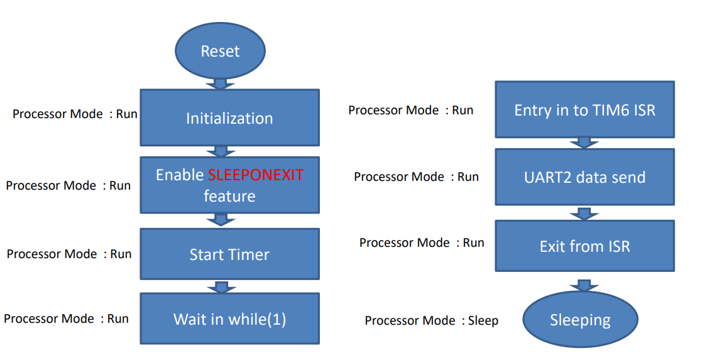

# Low Power Operation using SLEEPONEXIT in STM32 Microcontroller Units (MCUs)

## Project Description
This project intends to create an application using an STM32 MCU, specifically focusing on the implementation and examination of its low power sleep mode. The core operation revolves around configuring Timer 6 (TIM6) to trigger an Update interrupt every 10 milliseconds. This interrupt will then invoke a service routine to transmit data via the UART2 interface.

The crucial aspect of our project lies in measuring the current consumption in two distinct scenarios - one with the standard operation (without sleep mode) and the other with the device set to sleep mode using the SLEEPONEXIT feature.

What is the SLEEP ON EXIT Feature?
When the processor completes the execution of al exception handlers, it enters sleep mode.   
Any Peripheral interrupt acknowledged by the NVIC can wake up the device (Specific to NUCLEO-F446ZE).

## Flow Chart

### Hardware
- NUCLEO-F446ZE MCU (STM32)

### Methodology
1. **Standard Operation**: Initially, we will establish the MCU's operation without employing any low power modes. The focus will be on setting up TIM6 to trigger an Update interrupt every 10ms, which will, in turn, initiate a routine to send data via UART2. The current consumption in this regular operational mode will be measured and recorded for reference.

    - **Standard Operation TIM6 ISR**
        Let's confirm that the TIM6 Interrupt is toggling every 10ms, for debugging purposes I made it so that a GPIO toggles every ISR (Interrupt Service Routine).

        

        **Standard Operation Current Measurement**  
          
        We can see that the UART is working and that the MCU is consuming 3.73 mA

2. **Low Power Operation**: In this phase, we will incorporate the SLEEPONEXIT feature, thereby instructing the MCU to enter sleep mode upon exiting the last executed interrupt routine. The same application will run as in the previous phase, but this time with the MCU entering sleep mode when idle, thus minimizing power consumption. The current consumption in this low power mode will be measured and contrasted with the previous results

    - **Standard Operation TIM6 ISR**
        Let's confirm that the TIM6 Interrupt is toggling every 10ms.

        

        **Standard Operation Current Measurement**  
          
        We can see that the UART is still working but the MCU is consuming 2.82 mA

### Conclusion
Both casses have the exact same code, except one has one extra line: HAL_PWR_EnableSleepOnExit();, which is a function provided by STM32 HAL API, it essentially does this: SCB->SCR |= 1U << 1, and this code simply activates the SLEEPONEXIT feature.   

We can conclude that by simply activating the SLEEPONEXIT feature, which is ideal for interrupt-based applications, we haved saved almost 1mA. This may not seem like much, but consider if the MCU was attached to a battery with limited capacity. In this case a small decrease in current consumption like 1mA can make huge impacts on the capabilites of the MCU.
